# Guitar's history

# User Experience (UX)

[View the live project here](https://mariaarnesson.github.io/the_history_of_the_guitars/)

On my website you find the history of a very popular musical instrument, which is the guitar. I described where the guitar comes from and in which countries it is used, and also what different types of guitars exist. There is a timeline about the entire history of guitars too.

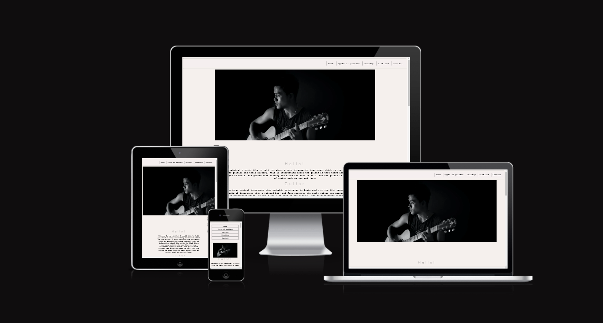

## Features
### Navigation Bar
- Featured on all five pages. the full responsive navigation bar includes links to the  Home page, Type of guitars, Gallery, Timeline,  and Contact page and is identical in each page to allow for easy navigation.

- This section will allow the user to easily navigate from page to page across all devices without having to revert back to the previous page via the ‘back’ button.

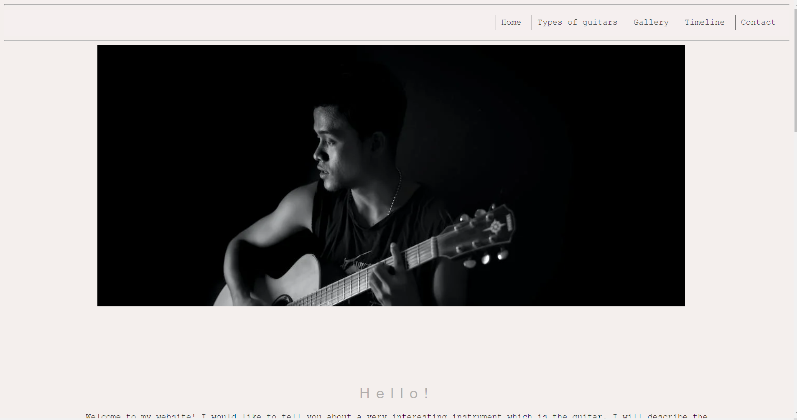
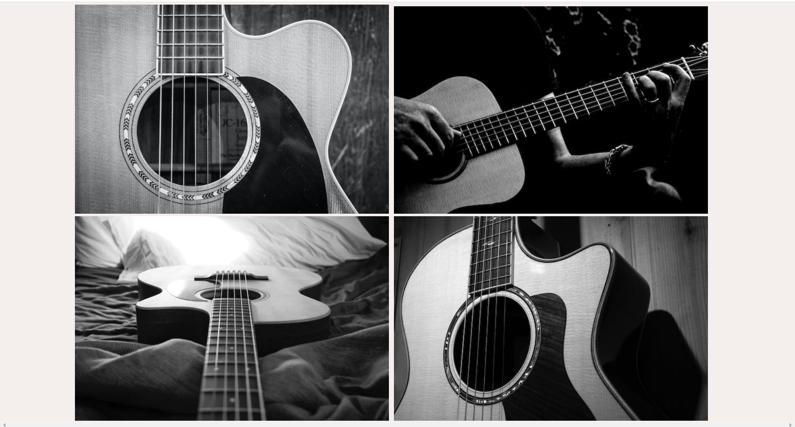
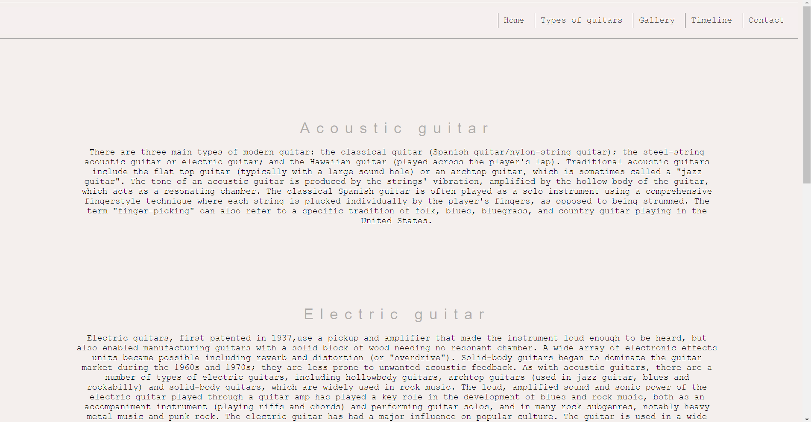
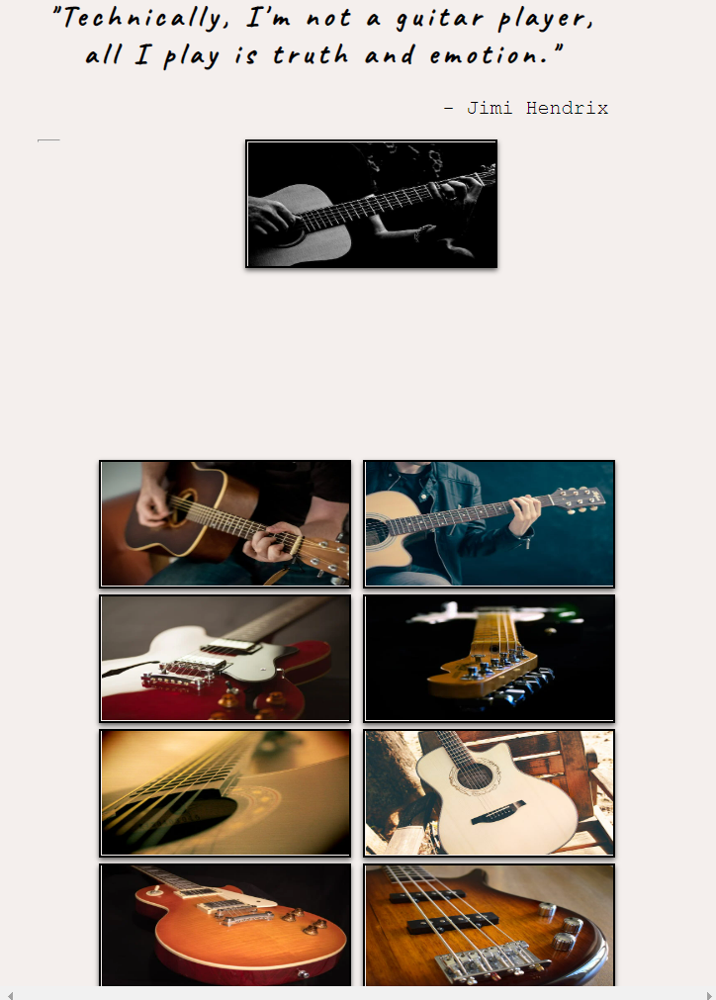
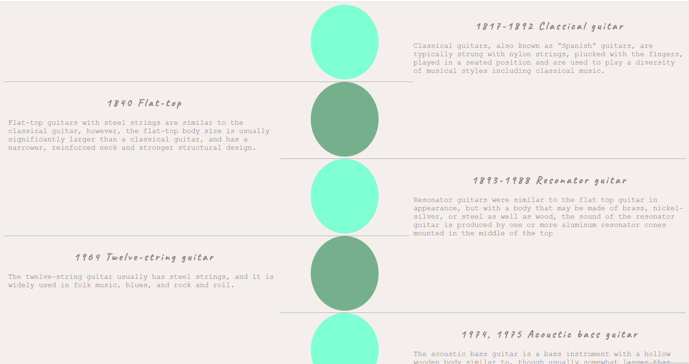
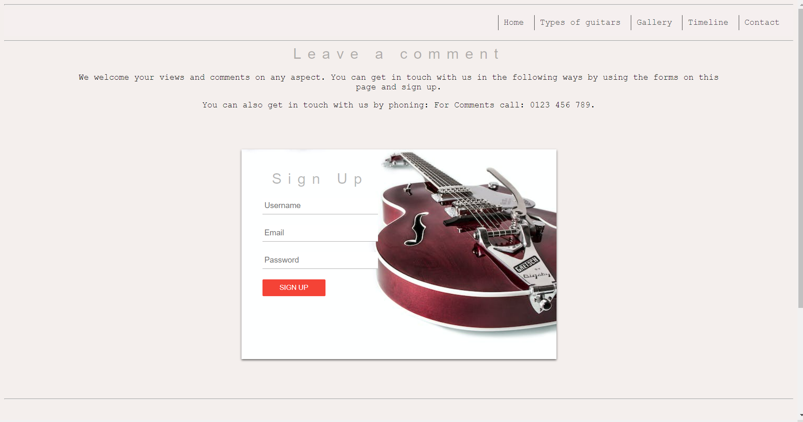

# Testing 

## Validator Testing

- HTML
No errors were returned when passing through the official W3C validator

- CSS
No errors were found when passing through the official (Jigsaw) validator
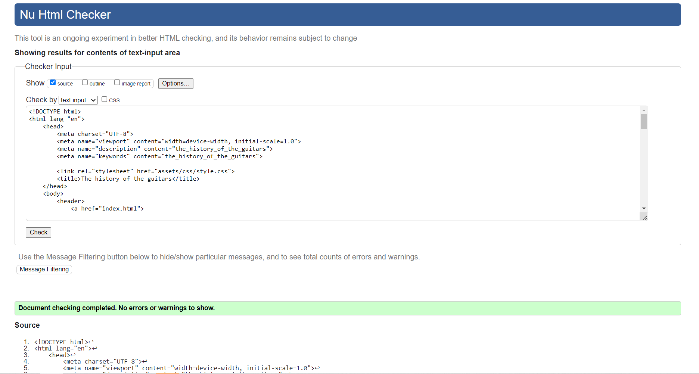
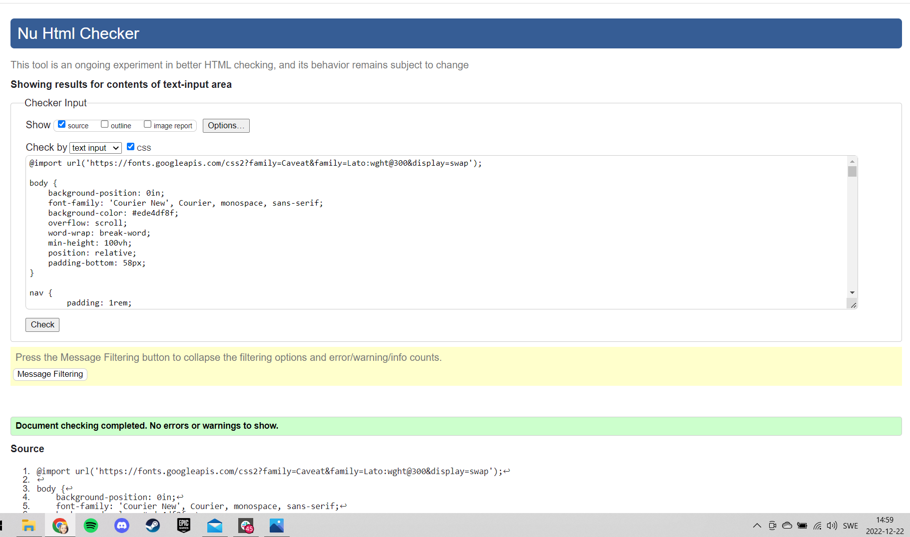

# Visitor Stories

As a visitor to The history of guitars I expect/want/need:

- The position structure and purpose of a navigation bar:
    - A navigation bar is placed at the top of the website.
    - The navbar shows the user appropriate links

- The position structure and purpose of a footer:
    - Social media links are provided in the footer.

- The position structure and purpose of a Home Page:
    - On the Home Page there is a main picture and two sections. 
    - The first section contains the introductory text and the second section contains four pictures. 
    - The font is adapted to be legible and visible to users. 
    - Text and pictures are centered to make the structure easy to read.

- The position structure and purpose of a Types of guitars Page:
    - On this page there is one section with four divs where each of the divs describes each type of guitar. 
    - The text is centered and the font is clear and readable for the user.

- The position structure and purpose of a Gallery Page:
    - At the top of the page is a photo of the guitarist and a quote where the guitarist talks about playing the guitar.
    - Below is one section with a series of different pictures of guitars.  

- The position structure and purpose of a Timeline Page:
    - At the top is one image centered in a clear way so that the user can easily understand what the page is about.
    - Underneath there are several divs in them text and date. Every other one is on the left and every other one is on the right.
    - The date font is bold and in a different font than the rest of the text

## User stories testing:

- Home > Types of guitars > Gallery > Timeline > Contact

(thank you side)

## Testing User Experience (UX) stories 

- As a new user I want to find information and learn more about the history.
    - After loading the website, there is a clear navigation bar at the top of the page that allows the user to easily navigate to all the platform that exist on the page.
    - Information about the history of guitars is easily to found on the main page and also on the Types of guitars page. 
    - Additional information can be found by contacting the website author on the contact page.
    - The user will find information and learn about the history of guitars by scrolling down or pressing another button in the navigation field
- As a new user I want to easily understand the main purpose of the site.
    - The main purpose of the site is visible on the first page where you can see a photo of a man with a guitar and text about guitars below. 
    - No matter what page the new visitor lands on, they can easily find and use the navigation bar.
- As a new user I want to be able to easily navigate the entire site to find content.
    - Navigating the entire site to find content is possible by scrolling down.
    - The user has access to five buttons in the navigation bar.

- As a new user I want to be able to easily navigate to and see what types of guitars are available. 
    - The ability to easily navigate and check what types of guitars are available is possible by pressing the types of guitar button
- As a new user I want to be able to see images in the gallery. 
    - the ability to view photos in the gallery is available by pressing the gallery button.
- As a new user I want to be able to fill out the form to receive newsletters on my e-mail. 
    - filling out the form to receive newsletters to my e-mail is possible by pressing the contact button.
- As a returning user I want to be able to access and view the entire page quickly and easily. 
    - quick and easy access to the entire site and browsing it is available on all pages and using the navigation bar can be done in a quick way.
- As a returning user I want to be able to quickly and easily check what kinds of guitars exists. 
    -  - The ability to easily navigate and check what types of guitars are available is possible by pressing the types of guitar button
- As a returning user I want to be able to contact the organization to give feedback or ask questions. 
    - the possibility of contacting the organization in order to provide feedback or ask questions is possible by pressing the contact button and contacting by phone using the number provided on this page.
- As a returning user I want to check information about the history and date in case I have forgotten it. 
    - information about the history and date can be checked by pressing the timaline button and searching in the text provided on this page.

# Manual Testing

Here is a detailed description of how manual testing is performed:

## Testing on desktop

All steps are performed in browsers: Chrome, Edge and Firefox.

### This has been verified on every page:
- Navigation bar:
    - Hover over each link has been made. The effect has been confirmed to be correct.
    - The Home page link has been pressed and confirmed to take the user to the Home page.
    - The Types of Guitars page link has been pressed and confirmed to take the user to the Types of guitars page.
    - The Gallery page link has been pressed and confirmed to take the user to the Gallery page.
    - The Timelines page link has been pressed and confirmed to take the user to the Timelines page.
    - The Contact page link has been pressed and confirmed to take the user to the Contact page.

- Footer:
    - It has been verified that the footer is displayed as expected.
    - After clicking on the icons: Facebook, Twitter, Instagram, Pinterest, it was confirmed that they open social media pages in separate browser tabs.

### Home Page

1. Home Page Images
    - It has been confirmed that the main image on the site is clear and shows up after the page loads.
    - All pictures on the home page have been reviewed and verified to be the correct size.    

2. Home Page Text
    - It has been confirmed that the title and text are correct and display correctly.    

### Types of guitars Page

1. Text
     - It has been confirmed that the title and text are correct and display correctly.

### Gallery Page

1. Quote
     - It has been confirmed that the quote is correct, in the right place and display correctly. 

2. Gallery Page Images
    - It has been confirmed that the main image on the site is clear and shows up after the page loads.
    - All pictures on the gallery page have been reviewed and verified to be the correct size and on correct place. 

### Timeline Page

1. Timeline Page Image
    - It has been confirmed that the main image on the site is clear and shows up after the page loads.

2. Timeline Page Text
    - It has been confirmed that the title and text are correct and display correctly and on correctly place. 

3. Timeline Page Circles 
    - The circles are displayed in the correct place - in the middle between one and the other event text.

### Contact Page

1. Contact Page Image next to the form
    - It has been confirmed that the main image on the site is clear and shows up after the page loads.

2. Contact Page Text
    - It has been confirmed that the title and text are correct and display correctly and on correctly place.

3. Contact Page Form
    - It has been confirmed that the contact page form is laid out as expected.
    - It has been confirmed that if a user submits a form without filling out the required fields, a message is shown to complete them.
    - It has been confirmed that it shows a message with a valid e-mail address if the user enters a name other the e-mail address in the e-mail input field. 
    - it has been confirmed that after completing the form correctly and pressing submit, the user will go to the Thank you page.

## Testing undertaken on tablet and phone devices

All steps have been entered and checked both in the Firefox browser on the tablet and in the iPhone browser.
### This has been verified on every page:
- Navigation bar:
    - It has been confirmed that on a small screen on a mobile phone the navigation bar is arranged in a list where the pages are stacked one below the other.
    - It has been confirmed that on the tablet screen the navigation bar is placed in buttons next to each other.
    - Links on the navigation bar has been pressed and confirmed to take the user to the correct page. 

- Footer:
    - It has been checked that on the tablet and mobile phone the footer is displayed as expected.
    - After clicking on the icons: Facebook, Twitter, Instagram, Pinterest, it was confirmed that they open social media pages in separate browser tabs.

### Home Page

1. Home Page Images
    - It has been confirmed that the main image on the mobile phone and tablet screen is clear and shows up after the page loads.
    - All pictures on the home page have been reviewed and verified to be the correct size.    

2. Home Page Text
    - It has been confirmed that the title and text on the mobile phone and tablet screen are correct and display correctly.    

### Types of guitars Page

1. Text
     - It has been confirmed that the title and text are correct and display correctly on the mobile phone and tablet screen

### Gallery Page

1. Quote
     - It has been confirmed that the quote is correct, in the right place and display correctly on the mobile phone and tablet screen.

2. Gallery Page Images
    - It has been confirmed that the main image on the mobile phone and tablet screen is clear and shows up after the page loads.
    - All pictures on the gallery page on the mobile phone and tablet screen have been reviewed and verified to be the correct size and on correct place. 

### Timeline Page

1. Timeline Page Image
    - It has been confirmed that the main image on the mobile phone and tablet screen is clear and shows up after the page loads.

2. Timeline Page Text
    - It has been confirmed that the title and text on the mobile phone and tablet screen is correct and display correctly and on correctly place. 

3. Timeline Page Circles 
    - The circles on the mobile phone and tablet screen are displayed in the right place - as the background of the event text.

### Contact Page

1. Contact Page Image next to the form
    - It has been confirmed that the main image on the mobile phone and tablet screen is clear and shows up after the page loads.

2. Contact Page Text
    - It has been confirmed that the title and text on the mobile phone and tablet screen is correct and display correctly and on correctly place.

3. Contact Page Form
    - It has been confirmed that the contact page form is laid out as expected.
    - It has been confirmed that if a user submits a form without filling out the required fields, a message is shown to complete them.
    - It has been confirmed that it shows a message with a valid e-mail address if the user enters a name other the e-mail address in the e-mail input field. 
    - it has been confirmed that after completing the form correctly and pressing submit, the user will go to the Thank you page.

### Manual (logical) testing of all elements and functionality on every page. 

#### Home Page: 
1. Navigation bar: 
    -
    -
    -
    -
    -
    -
2. Hero image / video: 
    -
    -
    -
    -
    -
3. Compelling copy section: 
    -
    -
    -
    -
    -
4. Testimonials: 
    -
    -
5. Call to action button: 
    -
    -
6. Footer:  
    -
    -
    -
7.  Review all functionality and responsiveness on my mobile phone and tablet.
#### Types of guitars Page:
1. Navigation bar: 
    -
    -
    -
    -
    -
    -
2. Hero image / video: 
    -
    -
    -
    -
    -
3. Compelling copy section: 
    -
    -
    -
    -
    -
4. Testimonials: 
    -
    -
5. Call to action button: 
    -
    -
6. Footer:  
    -
    -
    -

#### Timaline Page: 
1. Navigation bar:  
    -
    -
2. Hero image: 
    -
    -
3. Page images:  
    -
    -
4. Page content:  
    -
    -
5. Call to action buttons:
    -
    -
6. Footer:
    -
    -
7. Review all functionality and responsiveness on my mobile phone and tablet. 
    -

#### Gallery Page: 

1. Navigation bar:  
    -
2. Hero image: 
    -
3. Gallery: 
    -
4. Call to action buttons:  
    -
5. Footer: 
    -
    -
#### Contact Page: 

1. Navigation bar:  
    -
2. Hero image: 
    -
3. Contact form:  
    -
4. Footer: 
    -
5. Review all functionality and responsiveness on my mobile phone and tablet.
    -

## Further testing: 
1. Asked fellow students, friends and family to look at the site on their devices and report any issues they find. _margins were adjusted for navigation bar after feedback that "request quote" button was too close to nav menu on some devices_ 

## Testing Lighthouse

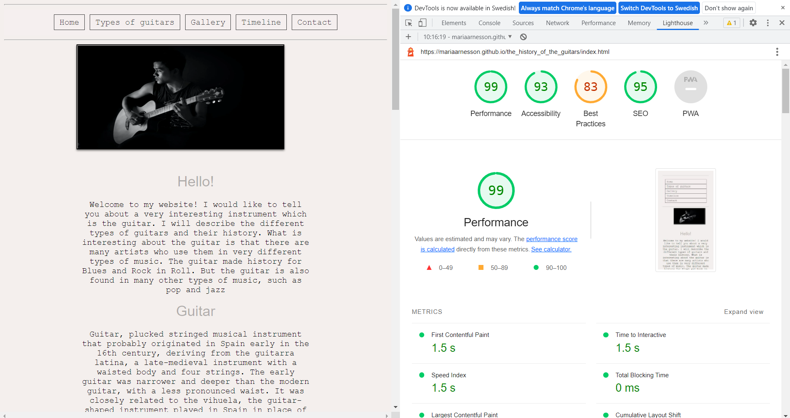
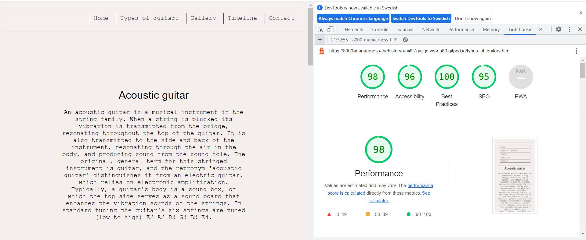
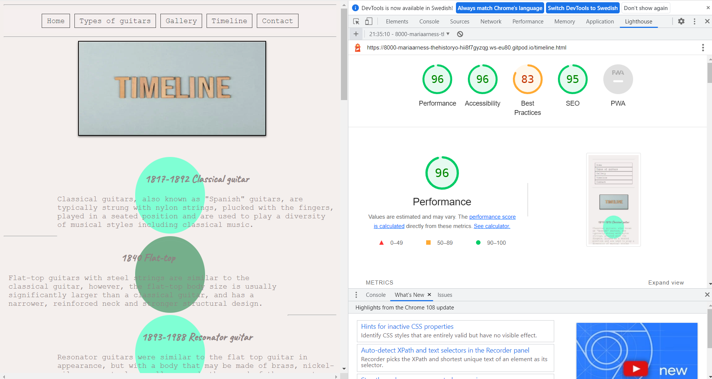
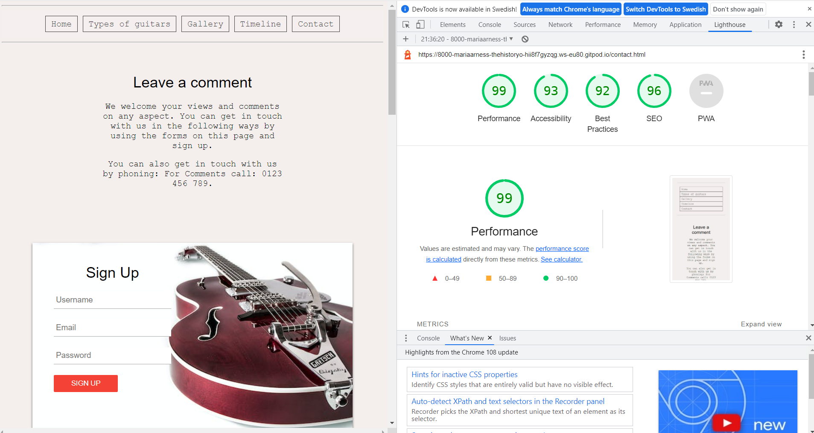

# Designe
## Colour Adobe

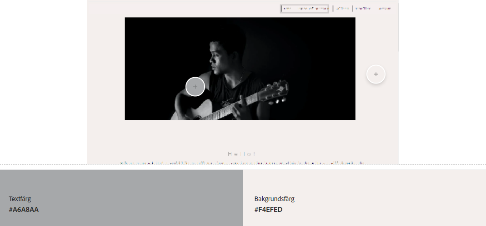

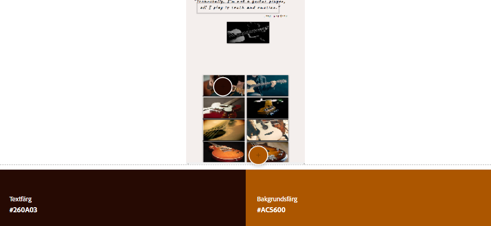
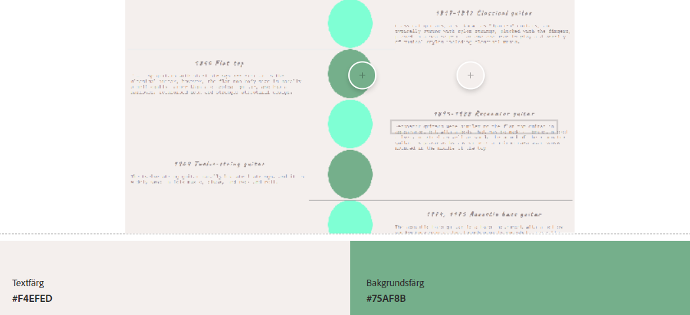
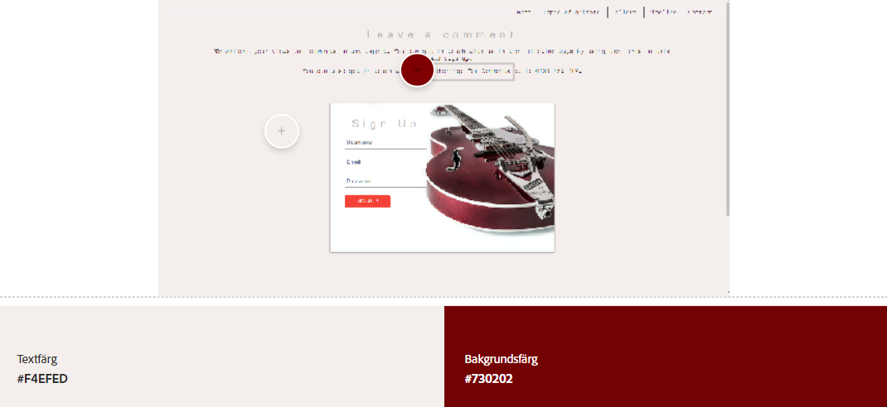

## Wireframes

- Main Page Wireframes
 - Desktop:
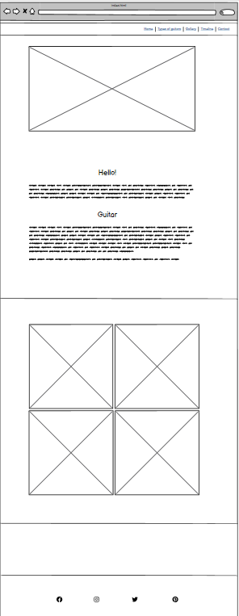
 - Iphone:
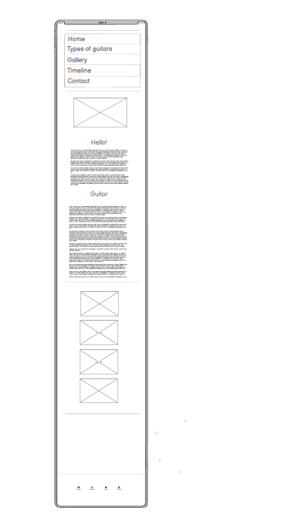
 - Ipad:
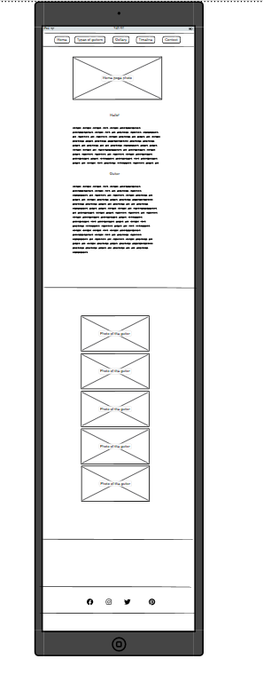

- Types of guitars Page Wireframes
 - Desktop:
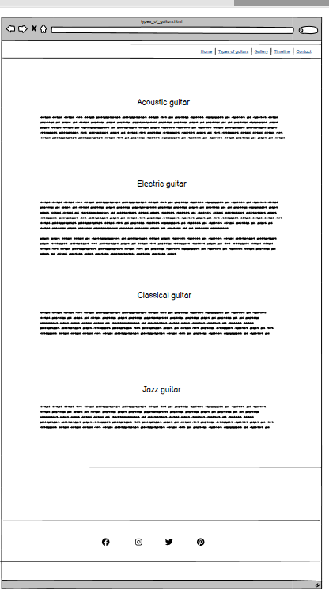
 - Iphone:
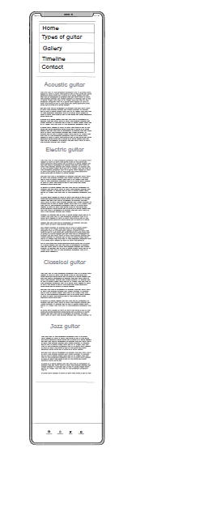
 - Ipad:
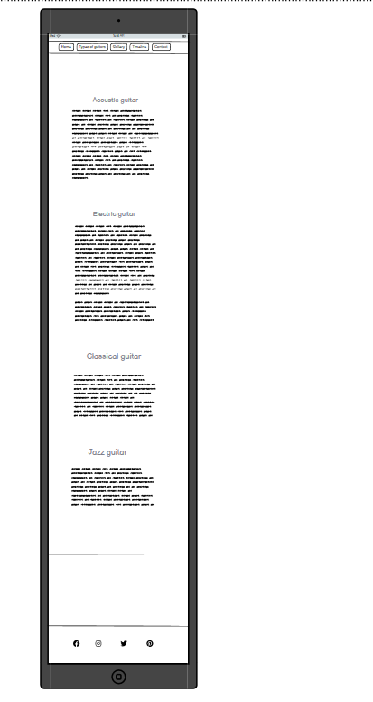
## Deployment
## Credits
### Information about the guitars was taken from:
- [Britannica](https://www.britannica.com/art/guitar)
- [Wikipedia](https://en.wikipedia.org/wiki/Musical_instrument)
- [Stage Music Center](https://stagemusiccenter.com/)

### Pictures was takem from:
- [Pexels](https://www.pexels.com/sv-se/)

### Inspiration about html buidnings home page was taken from:
- [how-to-create-columns-in-html](https://www.educative.io/answers/)
  

### The icons in the footer were taken from:
- [Font Awesome](https://fontawesome.com/icons/dumbbell?s=solid&f=classic)